# ElectronicaDigital1-laboratorio1
Desarrollo de la práctica 1 de laboratorio sobre la comparación de tecnologías TTL y CMOS

## Introducción
El propósito de este laboratorio fue estudiar y comparar las características de dos tecnologías de circuitos integrados: TTL (Transistor-Transistor Logic) y CMOS (Complementary Metal-Oxide-Semiconductor), a través de dispositivos específicos (74LS04 y CD4069). Se analizaron sus especificaciones eléctricas, se diseñaron circuitos de prueba y se evaluaron parámetros clave como niveles lógicos, tiempos de propagación, disipación de potencia, fan-in, fan-out y sensibilidad a condiciones experimentales.

Además, se implementaron osciladores en anillo para explorar la viabilidad de cada tecnología en aplicaciones prácticas y contrastar su comportamiento en términos de frecuencia de oscilación y forma de onda. Este estudio permite comprender las ventajas y limitaciones de ambas tecnologías, guiando la selección adecuada según los requerimientos de diseño.

## Procedimeinto
### Parte 1
  1. Se revisaron los datasheets de los dispositivos 74LS04 y CD4069 proporcionados por el fabricante. Se identificaron y registraron los parámetros relevantes como VIH, VIL, VOH, VOL, tPHL, tPLH​, entre otros, para realizar una comparación directa. 
  
  2. Se analizaron los esquemas de aplicación recomendados en los datasheets para identificar los circuitos equivalentes típicos.
  
  3. Se implementó un circuito de prueba para cada dispositivo en el que se aplicó una señal cuadrada de 1 kHz con una amplitud adecuada. Utilizando un osciloscopio, generador de señales y una fuente DC con VCC= 5V,se midieron los niveles de VOUT en función de VIN para obtener la función de transferencia y determinar   VIH, VIL, VOH, VOL.
  
### Parte 2
  1. Se determinó el fan-in y fan-out de cada uno de los dispositivos; el fan-in consiste en el número de entradas mientras que el fan-out se determinó con midiendo la relación entre las corrientes de entrada y salida con cada uno de los dispositivos.
  2. Se calculó la disipación de potencia.
  3. Se realizó la implementación de un circuito de entrada y de salida para que fuera funcional tanto para el TTL como para el CMOS teniendo en cuenta los parámetros encontrados en la sección anterior para analizar el comportamiento del mismo.

### Parte 3
En esta última parte se planteó estudiar el oscilador en anillo basado en la compuerta NOT. Para ello se realizó el montaje de dos osciladores en anillo con el negador CMOS, por facilidad se escogió hacerlos con 3 y con 5 entradas.
 En base a esto, se realizó la lectura de de su frecuencia de oscilación y de la forma de su onda, para luego hacer una comparación entre amboos osciladores según lo observado.

## Resultados y análisis

### Parte 1
#### 1. Comparación de los datascheets.

Al comparar las especificaciones de los dos dispositivos que se encuentran en los datasheets se pudo determinar

El de tecnología CMOS, tiene un consumo de corriente extremadamente bajo cuando las entradas están en un estado estable, ya que los transistores CMOS consumen corriente principalmente durante las transiciones. En contraste, el 74LS04, al ser de tecnología TTL, consume corriente constantemente debido a la polarización activa de los transistores bipolares. Entonces el CD4069 es mucho más eficiente en cuanto a consumo energético para aplicaciones de bajo consumo
  
  De la misma manera el CD4069 tiene un rango de voltaje de alimentación más amplio (3 V a 15 V) mientras que el 74LS04 opera en un rango más limitado (4.75 V y 5.25 V). Esto hace que el CD4069 sea más versátil en aplicaciones con diferentes niveles de alimentación o baterías. Además, la tecnología CMOS puede operar en un rango de temperatura más amplio (-55°C a 125°C) en comparación con el rango típico del 74LS04 (-40°C a 85°C) lo que permite que el CD4069 tenga una gama más grande de aplicaciones.
  
  Por otro lado, el 74LS04 tiene tiempos de propagación mucho más cortos que el CD4069, gracias a la tecnología TTL, que está optimizada para altas velocidades. El tiempo de propagación del 74LS04 es de aproximadamente 10 ns, mientras que el CD4069 tiene tiempos de propagación en el rango de 50 ns a 200 ns, dependiendo del voltaje de alimentación. Esto hace que el 74LS04 sea más adecuado para aplicaciones de alta frecuencia donde la velocidad es crítica. Tambien es más compatible con otros circuitos TTL sin necesidad de ajustes de niveles, mientras que el CMOS requiere atención especial para la compatibilidad con niveles lógicos TTL/CMOS.
       
  Si nos centramos en los niveles lógicos de entrada el 74LS04 tiene niveles lógicos específicos para tecnología TTL, mientras que el CD4069 ajusta sus niveles en función de la alimentación (Vcc). Esto hace que el CMOS sea más flexible en diferentes entornos de voltaje. En términos de salida, el CD4069 tiene valores más cercanos a los límites de Vcc (VOH y VOL), lo que lo hace ideal para aplicaciones digitales puras.
  
  Tambien se considera que el 74LS04 consume más corriente en sus entradas y salidas, mientras que el CD4069 tiene una corriente de entrada casi nula, ideal para circuitos de bajo consumo. Se puede decir que las corrientes de salida también reflejan que el 74LS04 está diseñado para manejar mayores cargas.
  
  En cuanto a tiempos de propegación, el TTL es significativamente más rápido, lo que lo hace más adecuado para aplicaciones que requieren alta velocidad.Mientras que el CMOS al ser más lento, es más adecuado para aplicaciones de baja frecuencia o señales analógicas.
    
Por último,  el CD4069 tiene márgenes más amplios entre los niveles de entrada válidos y los niveles de salida válidos, lo que lo hace más tolerante al ruido en las señales.

#### 2. Circuitos equivalentes

Los circuitos equivalentes del 74LS04 (TTL) y el CD4069 (CMOS) representan cómo están diseñadas internamente las compuertas NOT en cada dispositivo.
El circuito equivalente del TTL es el siguiente:
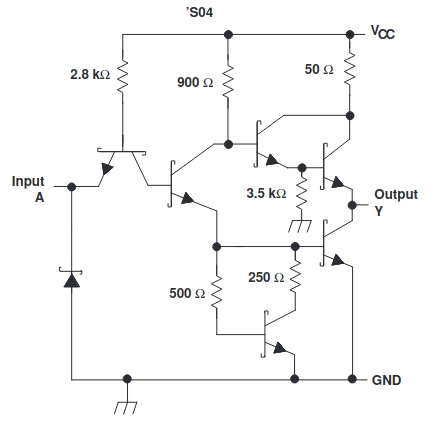

El circuito equivalente del CMOS es el siguiente:
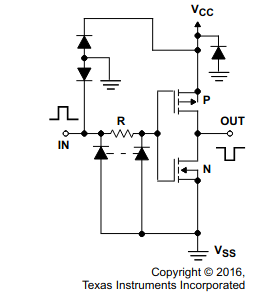

#### 3. Montaje y simulaciones
  Aplicando una señal cuadrada con una frecuencia de 1 KHz se obtuvieron los siguientes resultados, tanto en la simulaciones como en la práctica que se pueden contrastar con los teóricos.

##### TTL 74LS04
Se puede observar la simulación implementada
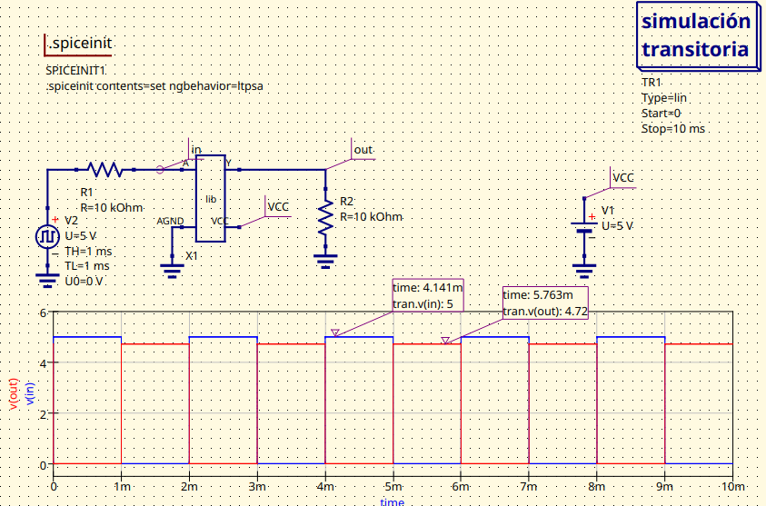

De la misma manera las señales obetnidas en el montaje; tambien se pueden visualizar otras imágenes en la carpeta de la parte 1
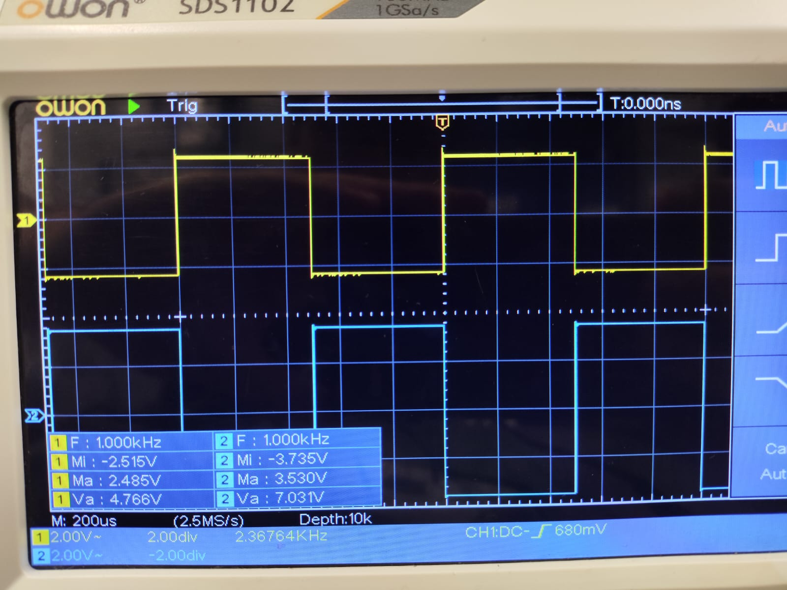

A partir de ello se obtuvieron las siguientes medidas

   El circuito TTL 74LS04 presenta un buen desempeño en términos de niveles altos de voltaje (VOH​), pero tiene problemas con los niveles bajos (VIL y VOL), lo cual podría generar inconsistencias lógicas. Además, los tiempos de respuesta son considerablemente más lentos que los valores teóricos, especialmente en la práctica, indicando limitaciones en la velocidad del dispositivo y condiciones experimentales.

Aunque si se considera el ciruito implementado las resistencias introducen retardos, distorsionan las señales cuadradas y afectan las mediciones de voltaje lógico, entonces se podría haber probado con valores mucho menores de resistencias para obtener resultados más adecuados. En la entrada Afecta la corriente de entrada, causando un incremento en VIL​ y posibles problemas en la interpretación de niveles bajos. En la salida, aumenta VOL e incrementa los tiempos de subida (tr) y bajada (tf), y los de propagación por el efecto RC.

 ##### CMOS CD4069
Se puede observar la simulación implementada

De la misma manera las señales obetnidas en el montaje; tambien se pueden visualizar otras imágenes en la carpeta de la parte 1
![MontajeParte1CMOS(Parte1/Fotos practica-Parte1/Ondas Caracterizacion.jpeg)

A partir de ello se obtuvieron las siguientes medidas
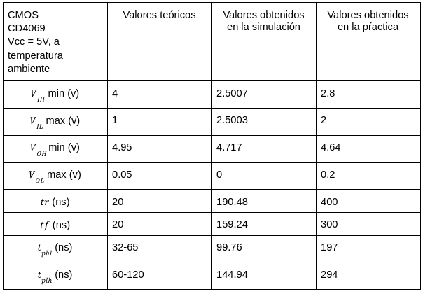

Al analizar los datos de entrada, los valores medidos en práctica y simulación son muy inferiores a los valores teóricos.
Esto se debe a que el CMOS es muy sensible a la impedancia en la entrada. Al colocar una resistencia de 10 kΩ, se limita la corriente que puede cargar la capacitancia de la puerta de entrada, lo cual altera los niveles de voltaje, por lo que no está obteniendo los valores lógicos requeridos.

En cuanto a la salida,el VOH es relativamente cercano al valor teórico (4.95V a 4.64V), por lo que las tecnolOgías CMOS tienen baja corriente de salida. En cuanto a los tiempos de subida, bajada y propagación que son mucho mayores a los teóricos puede ser debido ala constante de tiempo RC causada por las resistencias de 10 kΩ y la capacitancia parásita del circuito

#### ---

 En los resultados se observa que el CMOS es más sensible a las resistencias que el TTL, debido a la alta impedancia de entrada y baja capacidad de corriente en la salida. Aunque el TTL estuvo más próximo a los valores teóricos, ambos negadores fueron afectados por las condiciones experimentales y los altos valores en las resistencias.
 
### Parte 2
#### 1. Fan-in y Fan-out

El fan-in define la cantidad de entradas lógicas que puede manejar una puerta. En este caso, tanto en TTL 74LS04 como en CMOS CD4069, cada puerta lógica tiene 1 entrada por puerta inversora, por lo que el fan-in para ambos es 1.

El fan-out define cuántas puertas lógicas de la misma tecnología pueden ser controladas (alimentadas) por la salida de una sola puerta lógica. Para ello,se aplica una fórmula que relaciona la corriente máxima que una compuerta puede suministrar sin que su salida se distorsione con la corriente requerida por una unidad de carga.

  ##### TTL 74LS04
En primer lugar, para los cálculos teóricos se utilizaron los datos proporcionados en el datasheet
del fabricante:
  ###### Estado lógico alto.
La corriente máxima de salida (IOH) es de 0,4 mA, mientras que la corriente requerida de entrada por una carga (IIH) es de 20 μA. Usando la expresión: Fan-out.alto = IOH/IIH = 20

Por lo tanto, el fan-out en estado lógico alto es 20.

  ###### Estado lógico bajo.
En este caso, se consideran IOL y IIL, con valores de 8 mA y 0,4 mA respectivamente. Usando la expresión Fan-out.bajo = IOL/IIL = 20
El fan-out en estado lógico bajo también es 20.

En conclusión, el inversor 74LS04 tiene un fan-out teórico de 20 en ambos estados.

###### Simulación.
En esta etapa se realizó una simulación para verificar este valor, conectando diferentes n ´umeros de unidades de carga a la salida del inversor y midiendo la corriente requerida en cada configuración:

Con dicha simulación se midieron los valores en estado lógico alto y bajo para que al al final se recopile el menor valor.
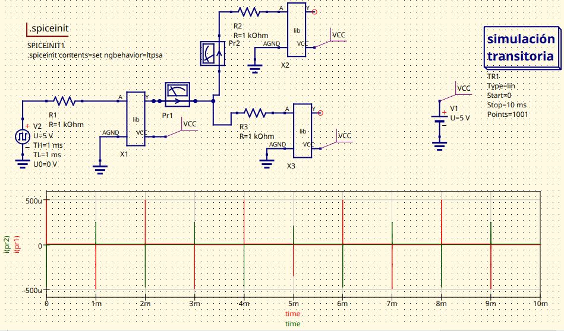
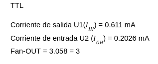

  ##### CMOS CD4069
  Al igual que con el TTL, para los cálculos teóricos se utilizaron los datos proporcionados en el datasheet
del fabricante:

  ###### Estado lógico alto.
La corriente máxima de salida (IOH) es de -0,52 mA pero se toma el valor absoluto, mientras que la corriente requerida de entrada por una carga (IIH) es de 0.01 μA. Usando la expresión: Fan-out.alto = IOH/IIH = 52 que se puede tomar como 50

Por lo tanto, el fan-out en estado lógico alto es 50.

  ###### Estado lógico bajo.
En este caso, los valores de los CMOS para IOL y IIL suelen ser muy pequeños y tiende a tomarse los mismos valores que en el estado lógico alto por lo que en conclusión el inversor CD4069 tiene un fan-out teórico de aproximadamente 50 en ambos estados.

###### Simulación.
En esta etapa se realizó una simulación para verificar este valor, se realizó la misma simulación que para el TTL:

Con lo que se obtuvieron los siguientes valores

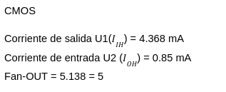

En teoría, CMOS debería tener un fan-out mucho mayor que el TTL, debido a sus menores corrientes de entrada. Sin embargo, los resultados experimentales muestran un fan-out similar en ambos dispositivos aunque se mantiene la relación de que el fan-out del CMOS sea el mayor. Lo cual indica que en las condiciones del experimento y la simulación, las corrientes medidas en CMOS fueron significativamente mayores a las esperadas, lo cual sugiere problemas relacionados con el circuito, la medición o las condiciones de carga. Esto resalta la importancia de considerar las condiciones de prueba y el impacto de factores externos al comparar dispositivos digitales.

#### 2. Disipación de potencia.
Debido a la incongruencia obtenida en el Fan-out experimental, la disipación de potencia tambien cuenta con resultados que no concuerdan con el comportamiento teórico por los mismos factores que se mencionaron anteriormente.

  ##### TTL 74LS04
  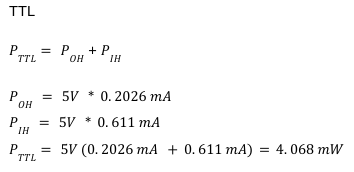
  

  ##### CMOS CD4069
  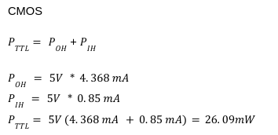

#### 3. Implementación circuito funcional para CMOS y TTL.
En el siguiente video se puede observar el funcionamiento del circuito propuesto de entrada y de salida para que fuera funcional tanto para el TTL como para el CMOS teniendo en cuenta los parámetros encontrados en la sección anterior para analizar el comportamiento del mismo.

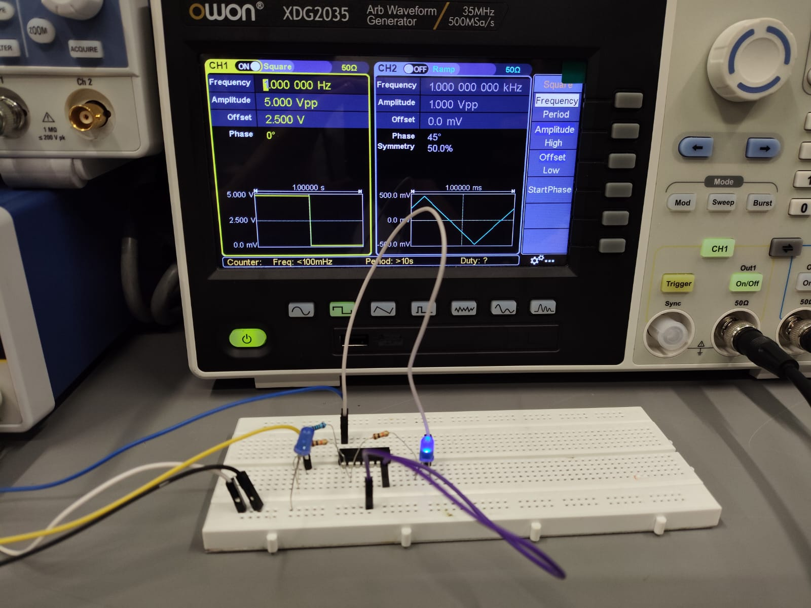

### Parte 3
Para esta última etapa se realizaron las simulaciones de un oscilador en anillo de 3 estpas y otro de 5 etapas implementando un CMOS dado a que como se mencionó anteriormente es generalmente más eficiente, versátil y adecuado para aplicaciones modernas que priorizan el bajo consumo de energía y la flexibilidad en el diseño por lo que serán más visibles las etapas.

Simulación del oscilador en anillo con 3 etapas en CMOS con el que se obtuvo una frecuencia de 1.718 MHz 
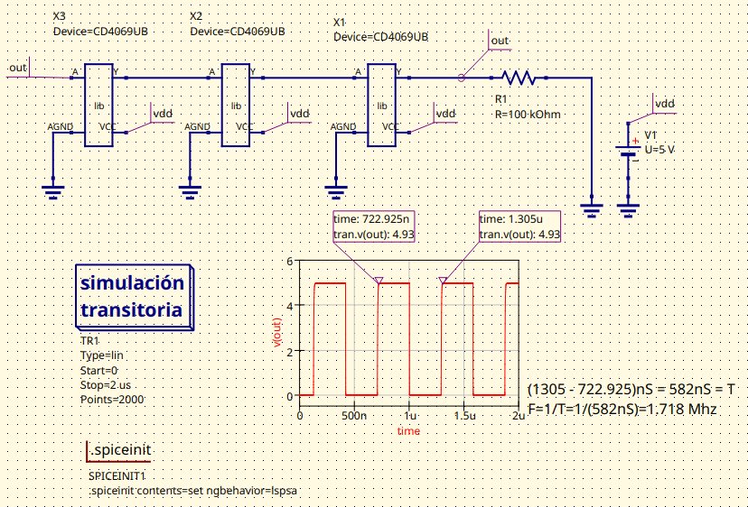

Simulación del oscilador en anillo con 5 etapas en CMOS con el que se obtuvo una frecuencia de 0.7689 MHz

Posterior a ello se dispuso a hacer el montaje experimental de ambos osciladores obteniendo los siguientes resultados

Oscilador en anillo experimental con 3 etapas en CMOS con el que se obtuvo una frecuencia de 3.50 MHz
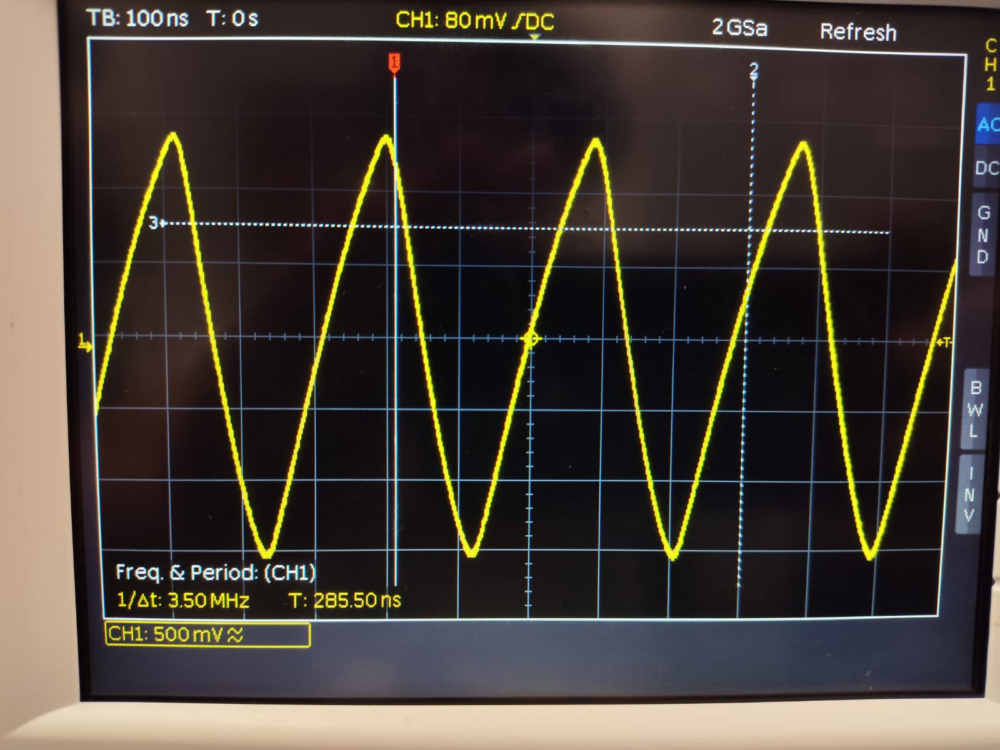

Oscilador en anillo experimental con 5 etapas en CMOS con el que se obtuvo una frecuencia de 2.13 MHz
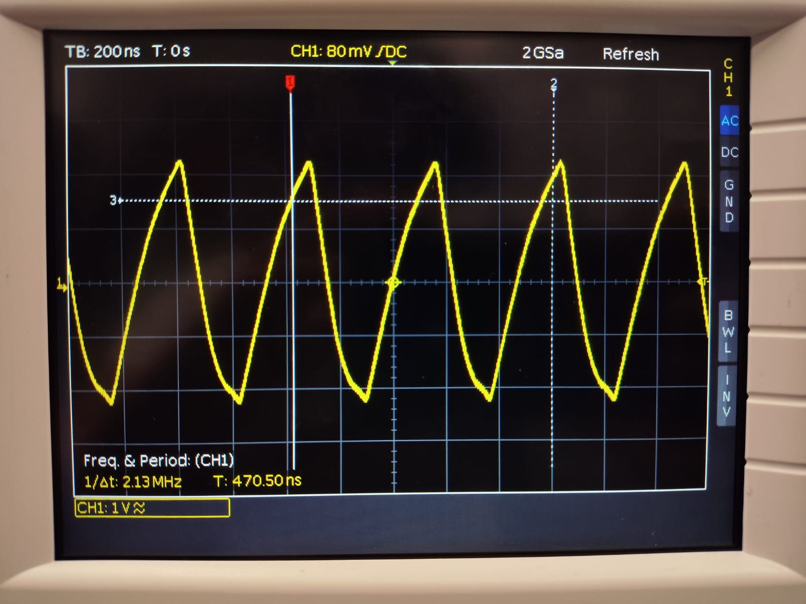

La frecuencia de oscilación está inversamente relacionada con el número de etapas en el oscilador. Es decir, a mayor número de etapas, mayor será el tiempo total de propagación del circuito, lo que lleva a una frecuencia más baja. Esto ocurre porque cada etapa introduce un retardo debido a la conmutación de la puerta negadora, y el tiempo total de propagación se acumula a medida que aumenta el número de etapas. Por lo tanto un oscilador con tres etapas tendrá un tiempo de propagación más bajo y con ello, una frecuencia más alta, y un oscilador con 5 etapas tendrá un tiempo de propagación más alto y una frecuencia más baja.

## Conclusiones
1. Los dispositivos CMOS (CD4069) demostraron ser más eficientes en términos de consumo energético, mayor rango de voltaje de operación y mejor tolerancia al ruido. Estas características los hacen ideales para aplicaciones de bajo consumo y entornos variados.
   
2. Por otro lado, los dispositivos TTL (74LS04) ofrecen tiempos de propagación significativamente menores, lo que los hace más adecuados para aplicaciones de alta velocidad o con requisitos estrictos de compatibilidad lógica. Sin embargo, consumen más energía y tienen un rango de operación más limitado.
   
3. En teoría, los dispositivos CMOS presentan un fan-out mayor debido a sus bajas corrientes de entrada y salida. Sin embargo, los resultados experimentales indicaron valores similares para ambos dispositivos, probablemente debido a factores externos como la impedancia de carga y condiciones de medición. Esto subraya la importancia de optimizar las condiciones experimentales para reflejar mejor el comportamiento teórico.
   
4. La frecuencia de oscilación en los osciladores en anillo está inversamente relacionada con el número de etapas, como se observó tanto en las simulaciones como en los resultados experimentales. Los osciladores con tecnología CMOS ofrecieron una implementación más eficiente en términos de consumo de energía, aunque con una sensibilidad mayor a las condiciones externas.
   
5. Tanto los dispositivos TTL como CMOS mostraron desviaciones respecto a los valores teóricos debido a factores como el uso de resistencias altas y la influencia de impedancias no ideales. Esto resalta la necesidad de considerar en próximos laboratorios la configuración del circuito para obtener resultados precisos y reproducibles.
   
6. La elección entre TTL y CMOS debe basarse en las necesidades específicas de la aplicación. Para sistemas que priorizan la velocidad y compatibilidad, TTL es una opción adecuada. Para aplicaciones de bajo consumo energético y alta flexibilidad, CMOS es preferible.

## Referencias
-Uelectronics.DataSheet TTL 74LS04(https://uelectronics.com/producto/cd4049be-inversor-hexadecima-dip-16/)
-Uelectronics.Datasheet CMOS CD4069(https://uelectronics.com/producto/74ls04-compuerta-not-sn74ls04n/?srsltid=AfmBOopSNMqnw9-t7gDojXjZ6zj2RbfQPI2q1okUrkqvsDHkUBCRXMIU)

-
