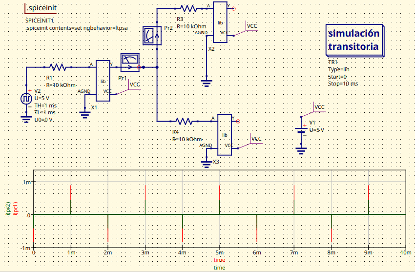
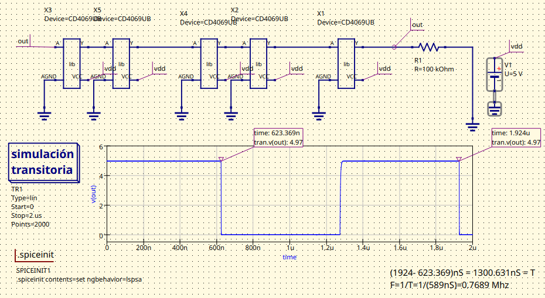
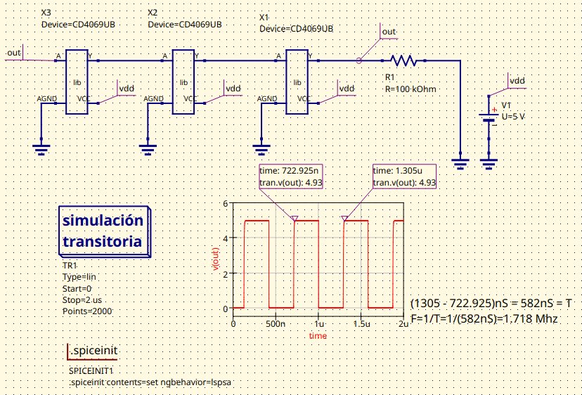

# ElectronicaDigital1-laboratorio1
Desarrollo de la práctica 1 de laboratorio sobre la comparación de tecnologías TTL y CMOS

## 2. Procedimeinto
### Parte 1
  1. Se revisaron los datasheets de los dispositivos 74LS04 y CD4069 proporcionados por el fabricante. Se identificaron y registraron los parámetros eléctricos relevantes como IH, VIL, VOH, VOL, t<PHL>OL, t<PLH>OL​, entre otros, para realizar una comparación directa. La información se organizó en una tabla para facilitar el análisis.
  
  2. Se analizaron los esquemas de aplicación recomendados en los datasheets para identificar los circuitos equivalentes típicos.
  
  3. Se diseñó un circuito de prueba para cada dispositivo en el que se aplicó una señal cuadrada de 1 kHz con una amplitud adecuada. Utilizando un osciloscopio, generador de señales y una fuente DC se midieron los niveles de VOUT en función de VIN para obtener la función de transferencia y determinar   VIH, VIL, VOH, VOL.
  
### Parte 2
  1. Se determinó el fan-in y fan-out de cada uno de los dispositivos; el fan-in consiste en el número de entradas mientras que el fan-out se determinó con midiendo la relación entre las corrientes de entrada y salida con cada uno de los dispositivos.
  2. Se calculó la disipación de potencia.
  3. ISe realizó la implementación de un circuito de entrada y de salida para que fuera funcional tanto para el TTL como para el CMOS teniendo en cuenta los parámetros encontrados en la sección anterior para analizar el comportamiento del mismo.

### Parte 3
En esta última parte se planteó estudiar el oscilador en anillo basado en la compuerta NOT. Para ello se realizó el montaje de dos osciladores en anillo con el negador CMOS, por facilidad se escogió hacerlos con 3 y con 5 entradas.
 En base a esto, se realizó la lectura de de su frecuencia de oscilación y de la forma de su onda, para luego hacer una comparación entre amboos osciladores según lo observado.

## Resultados y análisis

### Parte 1
1. Al comparar las especificas de los dos dispositivos se pudo determinar:

El de tecnología CMOS, tiene un consumo de corriente extremadamente bajo cuando las entradas están en un estado estable, ya que los transistores CMOS consumen corriente principalmente durante las transiciones. En contraste, el 74LS04, al ser de tecnología TTL, consume corriente constantemente debido a la polarización activa de los transistores bipolares. Entonces el CD4069 es mucho más eficiente en cuanto a consumo energético para aplicaciones de bajo consumo
  
  De la misma manera el CD4069 tiene un rango de voltaje de alimentación más amplio (3 V a 15 V) mientras que el 74LS04 opera en un rango más limitado (4.75 V y 5.25 V). Esto hace que el CD4069 sea más versátil en aplicaciones con diferentes niveles de alimentación o baterías. Además, la tecnología CMOS puede operar en un rango de temperatura más amplio (-55°C a 125°C) en comparación con el rango típico del 74LS04 (-40°C a 85°C) lo que permite que el CD4069 tenga una gama más grande de aplicaciones.
  
  Por otro lado, el 74LS04 tiene tiempos de propagación mucho más cortos que el CD4069, gracias a la tecnología TTL, que está optimizada para altas velocidades. El tiempo de propagación del 74LS04 es de aproximadamente 10 ns, mientras que el CD4069 tiene tiempos de propagación en el rango de 50 ns a 200 ns, dependiendo del voltaje de alimentación. Esto hace que el 74LS04 sea más adecuado para aplicaciones de alta frecuencia donde la velocidad es crítica. Tambien es más compatible con otros circuitos TTL sin necesidad de ajustes de niveles, mientras que el CMOS requiere atención especial para la compatibilidad con niveles lógicos TTL/CMOS.
       
  Si nos centramos en los niveles lógicos de entrada el 74LS04 tiene niveles lógicos específicos para tecnología TTL, mientras que el CD4069 ajusta sus niveles en función de la alimentación (Vcc). Esto hace que el CMOS sea más flexible en diferentes entornos de voltaje. En términos de salida, el CD4069 tiene valores más cercanos a los límites de Vcc (VOH y VOL), lo que lo hace ideal para aplicaciones digitales puras.
  
  Tambien se considera que el 74LS04 consume más corriente en sus entradas y salidas, mientras que el CD4069 tiene una corriente de entrada casi nula, ideal para circuitos de bajo consumo. Se puede decir que las corrientes de salida también reflejan que el 74LS04 está diseñado para manejar mayores cargas.
  
  En cuanto a tiempos de propegación, el TTL es significativamente más rápido, lo que lo hace más adecuado para aplicaciones que requieren alta velocidad.Mientras que el CMOS al ser más lento, es más adecuado para aplicaciones de baja frecuencia o señales analógicas.
    
Por último,  el CD4069 tiene márgenes más amplios entre los niveles de entrada válidos y los niveles de salida válidos, lo que lo hace más tolerante al ruido en las señales.

2. 
   
### Parte 2

### Parte 3

## Conclusiones

## Referencias
